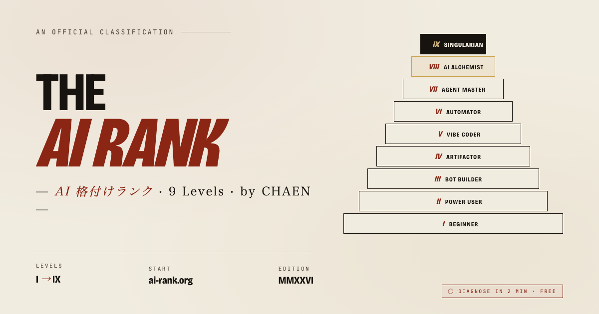

# THE AI RANK 🎖️

> **個人の AI 活用スキルを 9 段階で格付けする、世界共通のオープンな基準。**
>
> あなたの AI 熟達度は、どこまで来ているか？

🔗 **[ai-rank.org](https://ai-rank.org)** でいますぐ診断（約 2 分・無料）



---

## このプロジェクトについて

2026 年、AI は「使えるかどうか」ではなく、**「どこまで使いこなしているか」** で人と組織の差が決まる時代になりました。

THE AI RANK は、この **"AI 熟達度"** を誰でも共通言語で語れるように設計した、9 段階の格付けシステムです。

- **発案・監修**：[CHAEN](https://x.com/masahirochaen)（個人プロジェクト）
- **リリース**：2026 年 4 月
- **ライセンス**：MIT（格付け思想・コード共に）
- **ゴール**：このリポジトリで議論を集め、**「最強の世界共通 AI 格付けランク」** へ育てる

---

## 9 段階の全体像

下から順に：

| Lv. | 称号 | 一言で言うと |
|:---:|:---|:---|
| **I**   | **ビギナー** / Beginner                   | 無料 AI を検索代わりに使う |
| **II**  | **パワーユーザー** / Power User           | 汎用 AI 有料版＋特化型 AI を使い分け |
| **III** | **ボットビルダー** / Bot Builder          | GPTs 等で自分の業務を固定化 |
| **IV**  | **アーティファクター** / Artifactor       | Claude Artifacts 等で公開アプリを作る ★**非エンジニアの第一ゴール** |
| **V**   | **バイブコーダー** / Vibe Coder           | 社内本番ツールを自然言語で作る |
| **VI**  | **オートメーター** / Automator            | 業務を 24 時間自動稼働させる ★**非エンジニアの到達ライン** |
| **VII** | **エージェントマスター** / Agent Master    | 事業タスクを AI に委譲 |
| **VIII**| **AI アルケミスト** / AI Alchemist        | AI プロダクトで現実に収益化 ★**商業的本丸** |
| **IX**  | **シンギュラリアン** / Singularian         | AI が会社そのものを運営 |

各段階の詳細は [ai-rank.org](https://ai-rank.org) で読めます。

---

## 設計思想

### なぜ「格付け」か？

- 「ChatGPT を使っています」だけでは、実態のレベル差 **10 倍以上** を捉えられない
- 採用の現場・自己評価・社内研修設計で、共通の物差しが必要
- 単なる理論ではなく、**2026 年時点の最新 AI ツール群**（Claude Code / Artifacts / Manus / Lovable / Dify Auto / OpenClaw 等）を実戦的に反映

### なぜ「世界共通」か？

AI 熟達度は国境を越える普遍的な指標です。
このリポジトリでは、国・業界・職種を越えた **共通言語** としてのランクシステムを目指します。

### 4 つの原則

1. **実行力 ＞ 知識量** — 「知っている」ではなく「回している」で測る
2. **公開／配布 ＞ 自分用** — 自分専用で終わるものは 1 段下がる
3. **継続稼働 ＞ 単発** — 24 時間回っている仕組みを持つ者が上位
4. **他者貢献 ＞ 自己効率化** — 他者・業界・人類の生産性まで上げられる者が最上位

---

## 🤝 貢献歓迎（Contributors Wanted）

このプロジェクトは **皆で育てる** ことを前提に公開しています。

### こんな貢献を歓迎します

- **格付け基準の提案**：Lv.X の条件について議論／再定義の提案
- **新しい段階の追加**：時代が進むごとに、新たな Lv. の必要性
- **翻訳**：英語・中国語・韓国語・その他言語への展開
- **診断質問の改善**：より精度の高い判定につながる質問設計
- **UI／UX の改善**：Pull Request 歓迎
- **事例共有**：Lv.X の人が実際にやっている業務例

### 貢献方法

1. **Issue を立てる** — バグ報告／提案はまず Issue で議論
2. **Pull Request** — コード改善／誤字修正／新機能
3. **Discussions** — 設計思想／哲学的議論

貢献してくれた方は、[Contributors](https://github.com/chaenmasahiro0425/the-ai-rank/graphs/contributors) に掲載されます。

---

## 🧰 技術スタック

シンプルな静的 LP + Vercel Serverless Functions。

```
the-ai-rank/
├── index.html          # メインページ
├── style.css           # デザインシステム（Bricolage Grotesque / Instrument Sans / Shippori Mincho B1）
├── script.js           # 診断ロジック・証明書生成・モーダル
├── og-image.png        # OG/Twitter Card 画像（1200×630）
├── og-preview.html     # OG 画像生成元 HTML（Playwright でスクリーンショット）
├── favicon.svg
├── api/
│   └── signup.js       # 登録データを受けるエンドポイント
├── vercel.json         # Vercel 設定
├── POSTS.md            # X／ブログ投稿用文面
└── DATA_STORAGE.md     # 登録データの保管先についての説明
```

### ローカルで動かす

```bash
git clone https://github.com/chaenmasahiro0425/the-ai-rank.git
cd the-ai-rank
python3 -m http.server 4173
# → http://localhost:4173
```

### Vercel にデプロイ

```bash
vercel --prod
```

---

## 📊 診断の仕組み

- 10 問のマルチステップクイズ（各問 4 択）
- 回答クリックで自動的に次の質問へ（350ms ディレイ）
- Q1〜Q9：各問が Lv.I〜Lv.IX の判定
- Q10：業界貢献度のボーナスバッジ
- スコア 2 以上（C または D 回答）= その Lv. 到達と判定
- 最終ランク = 到達した最高 Lv.

診断結果は、名前入り・シリアル番号入りの **認定証** として発行されます。

---

## 🔐 プライバシー

- 診断結果はブラウザの localStorage に保存（サーバーには送信されません）
- SNS シェア／PNG 保存時のみ、**氏名・メール・会社名** の登録をお願いしています
- 登録情報は証明書発行・シェア機能、法人向け診断ツール（有料・準備中）の先行案内のみに使用
- 詳細は [DATA_STORAGE.md](./DATA_STORAGE.md) 参照

---

## 🏢 法人向け診断ツール（有料・準備中）

組織全体の AI 成熟度を診断したい企業向けに、以下を提供予定です：

- 全社員の AI レベル一斉診断
- 部署別ベンチマーク
- カスタム質問設計
- 成長トラッキング（四半期・年次）
- 個別研修プログラム
- 役員向けエグゼクティブサマリー

先行お問い合わせ：[X の @masahirochaen](https://x.com/masahirochaen) へ DM でご連絡ください。

---

## 🪪 ライセンス

MIT License — コピー・改変・商用利用すべて自由。
ただし、**「THE AI RANK」** の名前は登録商標として保護予定です（混同回避のため）。
派生格付けを作る場合は、別名をお使いください。

---

## 📣 関連リンク

- 🌐 **ウェブサイト**：https://ai-rank.org
- 🐦 **X (Twitter)**：[@masahirochaen](https://x.com/masahirochaen)
- 👤 **発案**：CHAEN（個人プロジェクト）

---

## 🙏 謝辞

AI 時代の 2026 年に合わせて、個人の視点から再設計しました。
既存の AI 関連スキル評価指標やクリエイター格付けなどの概念にインスパイアされています。

---

*Let's build the universal AI literacy standard together.*
*世界共通の AI 熟達度を、一緒に作りましょう。*

— **[CHAEN](https://x.com/masahirochaen)** · MMXXVI
